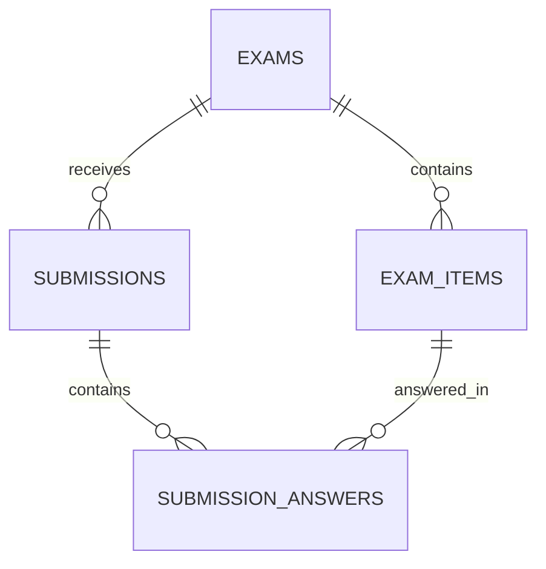
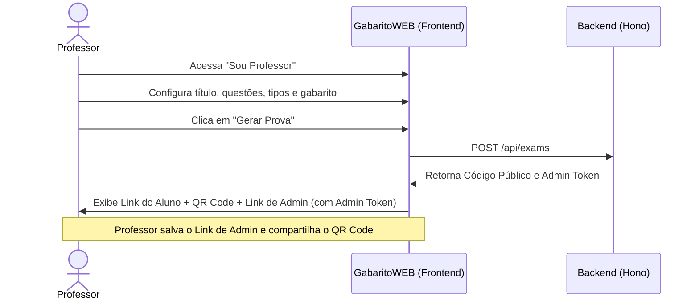
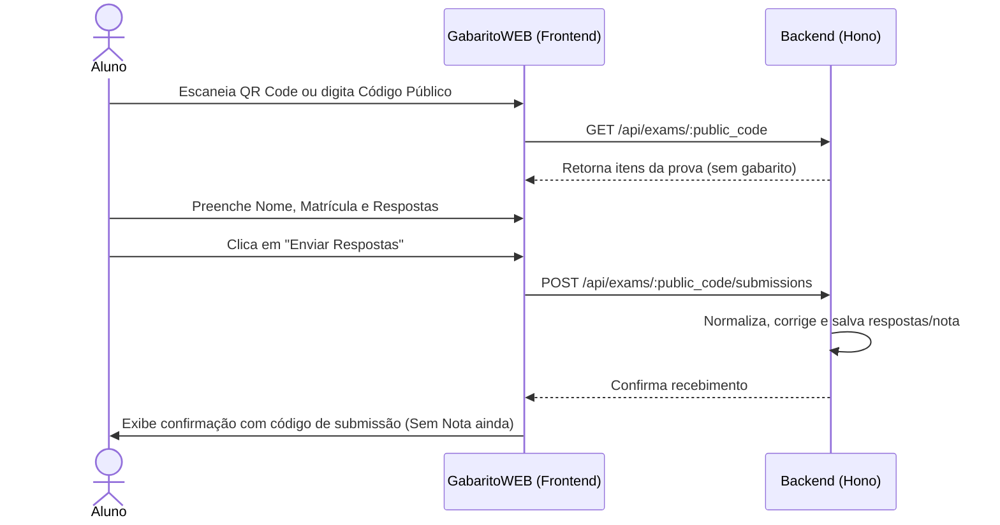

# Software Design Document (SDD) - GabaritoWEB (MVP)

Este documento especifica a arquitetura técnica, o modelo de dados, os fluxos de usuário, os contratos de API e as regras de correção do **GabaritoWEB**, um aplicativo web _mobile-first_ para registro e autocorreção de gabaritos de provas.

---

## 1. Arquitetura Geral

O sistema será desenvolvido com uma separação clara entre cliente (frontend) e servidor (backend):

- **Frontend**: Single Page Application (SPA) em **React + TypeScript + Vite + Tailwind CSS v4**.
- **Backend**: Servidor HTTP leve em **Node.js + Hono** com **SQLite** como banco de dados e **Drizzle ORM** para manipulação dos dados.
- **Comunicação**: REST API em formato JSON.

---

## 2. Modelo de Dados (SQLite + Drizzle ORM)

O banco de dados SQLite será persistido localmente em um único arquivo. A estrutura simplificada de tabelas trata toda questão como contendo pelo menos um item-folha respondível, agrupado visualmente pelo número da questão e sub-rótulo.



### 2.1. Tabela `exams`

Armazena as configurações e o status geral de cada prova gerada.

| Campo             | Tipo SQLite | Descrição                                                                    |
| :---------------- | :---------- | :--------------------------------------------------------------------------- |
| `id`              | `TEXT` (PK) | UUID ou NanoID gerado pelo servidor.                                         |
| `title`           | `TEXT`      | Título da prova (ex: "Física Geral I - Prova 1").                            |
| `public_code`     | `TEXT`      | Código público único de acesso (ex: `G26-DNEM9G`).                           |
| `admin_code_hash` | `TEXT`      | Hash SHA-256 do token administrativo do professor.                           |
| `status`          | `TEXT`      | Estado da prova: `'open'` (aberta para respostas) ou `'closed'` (encerrada). |
| `created_at`      | `INTEGER`   | Timestamp de criação (Epoch ms).                                             |
| `closed_at`       | `INTEGER`   | Timestamp de encerramento (Epoch ms, nulo se aberta).                        |

### 2.2. Tabela `exam_items`

Representa as questões e subitens respondíveis da prova (itens-folha).

| Campo                | Tipo SQLite | Descrição                                                        |
| :------------------- | :---------- | :--------------------------------------------------------------- |
| `id`                 | `TEXT` (PK) | UUID ou NanoID.                                                  |
| `exam_id`            | `TEXT` (FK) | Relacionado a `exams.id`.                                        |
| `question_number`    | `INTEGER`   | Número da questão (ex: `1`, `2`).                                |
| `sub_label`          | `TEXT`      | Rótulo do subitem (ex: `"a"`, `"b"` ou `NULL` para item único).  |
| `points`             | `REAL`      | Pontuação atribuída ao item (ex: `1.5`).                         |
| `answer_type`        | `TEXT`      | Tipo de correção: `'text_exact'`, `'choice'`, ou `'true_false'`. |
| `answer_config_json` | `TEXT`      | JSON contendo os parâmetros de resposta (gabarito aceito).       |
| `position`           | `INTEGER`   | Ordem de exibição do item na prova.                              |

### 2.3. Tabela `submissions`

Armazena a submissão de respostas realizada por cada aluno.

| Campo                | Tipo SQLite | Descrição                                              |
| :------------------- | :---------- | :----------------------------------------------------- |
| `id`                 | `TEXT` (PK) | Código de comprovante de submissão (6 caracteres base36, ex: `A7K9QF`). |
| `exam_id`            | `TEXT` (FK) | Relacionado a `exams.id`.                              |
| `student_name`       | `TEXT`      | Nome do aluno informado na submissão.                  |
| `student_identifier` | `TEXT`      | Matrícula ou identificador único informado pelo aluno. |
| `submitted_at`       | `INTEGER`   | Timestamp do momento do envio (Epoch ms).              |
| `total_score`        | `REAL`      | Nota final calculada do aluno na prova.                |

### 2.4. Tabela `submission_answers`

Armazena a resposta de um aluno para um item específico de uma prova.

| Campo               | Tipo SQLite      | Descrição                                           |
| :------------------ | :--------------- | :-------------------------------------------------- |
| `id`                | `TEXT` (PK)      | UUID ou NanoID.                                     |
| `submission_id`     | `TEXT` (FK)      | Relacionado a `submissions.id`.                     |
| `item_id`           | `TEXT` (FK)      | Relacionado a `exam_items.id`.                      |
| `raw_answer`        | `TEXT`           | Resposta textual original inserida pelo aluno.      |
| `normalized_answer` | `TEXT`           | Resposta após o pipeline de normalização.           |
| `is_correct`        | `INTEGER` (Bool) | Se a resposta foi considerada correta (`1` ou `0`). |
| `score_awarded`     | `REAL`           | Nota atribuída ao item (igual a `points` ou `0.0`). |

---

## 3. Fluxos de Usuário

### 3.1. Fluxo do Professor



### 3.2. Fluxo do Aluno



### 3.3. Fluxo de Visualização de Resultados (Aluno e Professor)

- **Professor**: Acessa a rota `/admin/:admin_token`. O frontend faz a requisição `GET /api/admin/exams/:admin_token`. O backend valida o token e retorna todos os dados da prova, estatísticas individuais de cada aluno, e permite ao professor encerrar a prova (`POST /api/admin/exams/:admin_token/close`).
- **Aluno**: Quando a prova é encerrada pelo professor, o aluno pode acessar a rota `/submissao/:submission_id` e consultar sua nota final detalhada com correção item por item via `GET /api/submissions/:submission_id`. Caso a prova continue aberta, a nota é ocultada.

---

## 4. Contratos de API (Endpoints)

Todas as requisições e respostas utilizam `Content-Type: application/json`.

### 4.1. Criar Prova (Professor)

- **Método**: `POST`
- **Rota**: `/api/exams`
- **Corpo da Requisição**:

```json
{
  "title": "Física Geral I - Segunda Prova",
  "items": [
    {
      "question_number": 1,
      "sub_label": "a",
      "points": 1.5,
      "answer_type": "choice",
      "answer_config": {
        "accepted": ["A"]
      }
    },
    {
      "question_number": 1,
      "sub_label": "b",
      "points": 2.0,
      "answer_type": "text_exact",
      "answer_config": {
        "accepted": ["MASSA", "PESO"]
      }
    },
    {
      "question_number": 2,
      "sub_label": null,
      "points": 3.0,
      "answer_type": "true_false",
      "answer_config": {
        "accepted": ["V"]
      }
    }
  ]
}
```

- **Resposta (201 Created)**:

```json
{
  "id": "exam_id_123",
  "public_code": "G26-DNEM9G",
  "admin_token": "adm_A7K9QF",
  "message": "Prova criada com sucesso!"
}
```

### 4.2. Buscar Prova pelo Código Público (Aluno)

- **Método**: `GET`
- **Rota**: `/api/exams/:public_code`
- **Resposta (200 OK)**:

```json
{
  "id": "exam_id_123",
  "title": "Física Geral I - Segunda Prova",
  "status": "open",
  "items": [
    {
      "id": "item_1",
      "question_number": 1,
      "sub_label": "a",
      "points": 1.5,
      "answer_type": "choice",
      "position": 1
    },
    {
      "id": "item_2",
      "question_number": 1,
      "sub_label": "b",
      "points": 2.0,
      "answer_type": "text_exact",
      "position": 2
    },
    {
      "id": "item_3",
      "question_number": 2,
      "sub_label": null,
      "points": 3.0,
      "answer_type": "true_false",
      "position": 3
    }
  ]
}
```

### 4.3. Enviar Respostas (Aluno)

- **Método**: `POST`
- **Rota**: `/api/exams/:public_code/submissions`
- **Corpo da Requisição**:

```json
{
  "student_name": "Maria Silva",
  "student_identifier": "2023101902",
  "answers": {
    "item_1": "A",
    "item_2": "massa ",
    "item_3": "verdadeiro"
  }
}
```

- **Resposta (201 Created)**:

```json
{
  "submission_id": "sub_9a8b7c6d5e",
  "message": "Respostas registradas com sucesso. A nota estará disponível após o encerramento da prova."
}
```

### 4.4. Consultar Submissão (Aluno)

- **Método**: `GET`
- **Rota**: `/api/submissions/:submission_id`
- **Resposta se Prova Aberta (200 OK)**:

```json
{
  "id": "sub_9a8b7c6d5e",
  "student_name": "Maria Silva",
  "student_identifier": "2023101902",
  "submitted_at": 1783478250,
  "exam_title": "Física Geral I - Segunda Prova",
  "status": "open",
  "total_score": null,
  "message": "A nota e o gabarito estarão disponíveis assim que a prova for encerrada pelo professor."
}
```

- **Resposta se Prova Fechada (200 OK)**:

```json
{
  "id": "sub_9a8b7c6d5e",
  "student_name": "Maria Silva",
  "student_identifier": "2023101902",
  "submitted_at": 1783478250,
  "exam_title": "Física Geral I - Segunda Prova",
  "status": "closed",
  "total_score": 6.5,
  "answers": [
    {
      "question_number": 1,
      "sub_label": "a",
      "points": 1.5,
      "raw_answer": "A",
      "is_correct": true,
      "score_awarded": 1.5
    },
    {
      "question_number": 1,
      "sub_label": "b",
      "points": 2.0,
      "raw_answer": "massa ",
      "is_correct": true,
      "score_awarded": 2.0
    },
    {
      "question_number": 2,
      "sub_label": null,
      "points": 3.0,
      "raw_answer": "verdadeiro",
      "is_correct": true,
      "score_awarded": 3.0
    }
  ]
}
```

### 4.5. Consultar Painel da Prova (Professor)

- **Método**: `GET`
- **Rota**: `/api/admin/exams/:admin_token`
- **Resposta (200 OK)**:

```json
{
  "id": "exam_id_123",
  "title": "Física Geral I - Segunda Prova",
  "public_code": "G26-DNEM9G",
  "status": "open",
  "created_at": 1783478234,
  "closed_at": null,
  "items": [
    {
      "id": "item_1",
      "question_number": 1,
      "sub_label": "a",
      "points": 1.5,
      "answer_type": "choice",
      "answer_config": {
        "accepted": ["A"]
      }
    },
    {
      "id": "item_2",
      "question_number": 1,
      "sub_label": "b",
      "points": 2.0,
      "answer_type": "text_exact",
      "answer_config": {
        "accepted": ["MASSA", "PESO"]
      }
    }
  ],
  "submissions": [
    {
      "id": "sub_9a8b7c6d5e",
      "student_name": "Maria Silva",
      "student_identifier": "2023101902",
      "submitted_at": 1783478250,
      "total_score": 3.5
    }
  ]
}
```

### 4.6. Encerrar Prova (Professor)

- **Método**: `POST`
- **Rota**: `/api/admin/exams/:admin_token/close`
- **Resposta (200 OK)**:

```json
{
  "status": "closed",
  "closed_at": 1783478900,
  "message": "Prova encerrada com sucesso. Notas liberadas para os alunos."
}
```

---

## 5. Regras de Normalização e Correção

Todas as strings fornecidas pelos alunos passam por um pipeline de limpeza antes da comparação.

### 5.1. Pipeline de Normalização Comum (Texto Geral)

1. **Trim**: Remove espaços no início e final.
2. **Unicode NFD**: Decompõe acentos e caracteres especiais (ex: `é` torna-se `e` + `´`).
3. **Remoção de Diacríticos**: Filtra acentos utilizando regex: `replace(/[\u0300-\u036f]/g, "")`.
4. **Remoção do Cedilha**: Mapeia `Ç` para `C`.
5. **Conversão para Maiúsculas**: `.toUpperCase()`.
6. **Colapsar Espaços**: Substitui múltiplos espaços por um espaço simples `replace(/\s+/g, " ")`.

### 5.2. Regras de Validação Específicas por Tipo

#### A. Múltipla Escolha (`choice`)

- **Regra**: O valor deve corresponder exatamente à letra selecionada.
- **Normalização**: Além da normalização comum, retira qualquer caractere que não seja uma letra e compara. (Normalmente o frontend envia apenas a letra exata do botão selecionado).

#### B. Verdadeiro ou Falso (`true_false`)

- **Regra**: Converte as variações linguísticas de verdadeiro ou falso para `V` ou `F`.
- **Mapeamento de Verdadeiro (`V`)**:
  - `"V"`, `"VERDADEIRO"`, `"VERDADE"`, `"SIM"`, `"S"`, `"TRUE"`, `"T"`
- **Mapeamento de Falso (`F`)**:
  - `"F"`, `"FALSO"`, `"NAO"`, `"N"`, `"FALSE"`
- **Comparação**: Se a resposta normalizada for classificada em uma dessas opções, ela será comparada com o gabarito. Se não for reconhecida, é computada como errada.

#### C. Texto Exato (`text_exact`)

- **Regra**: A resposta é correta se for idêntica (após normalização comum) a **qualquer** uma das variantes aceitáveis cadastradas no gabarito pelo professor.
- **Exemplo**:
  - Gabarito cadastrado: `["o mesmo", "a mesma", "igual"]`
  - Resposta do aluno: `"  À mesma. "`
  - Normalização do aluno: `"A MESMA"`
  - Normalizações do gabarito: `["O MESMO", "A MESMA", "IGUAL"]`
  - **Resultado**: Correto (Match com `"A MESMA"`).

---

## 6. Segurança e Robustez no MVP

1. **Tokens Administrativos Aleatórios**: O `admin_token` gerado terá a estrutura `adm_` + 6 caracteres base36 aleatórios com detecção e retry de colisão (ex: `adm_A7K9QF`).
2. **Armazenamento de Senha / Token**: O backend calcula o hash SHA-256 do token administrativo e armazena apenas o hash (`admin_code_hash`). No momento do acesso administrativo, calcula-se o hash do token recebido e compara-se com o valor no banco para evitar vazamentos em caso de roubo do arquivo SQLite.
3. **Códigos Públicos Não Sequenciais**: O `public_code` terá o formato `GYY-XXXXXX`, sendo `YY` os dois últimos dígitos do ano atual e `XXXXXX` uma string de 6 caracteres base36 aleatórios com detecção e retry de colisão (ex: `G26-DNEM9G`).
4. **Ocultação de Gabaritos**: A rota pública `/api/exams/:public_code` não expõe de forma alguma o campo `answer_config_json` (gabarito). O cálculo de acerto/nota é realizado estritamente no servidor.
5. **Rate Limiting no MVP**: Uma proteção na rota de submissão de respostas limitando requisições por IP a no máximo 5 submissões por minuto para prevenir spam de banco de dados.
6. **Prevenção de Duplicidade de Respostas**: O reenvio de respostas com a mesma matrícula (`student_identifier`) para a mesma prova está desabilitado. Se a matrícula já constar na tabela `submissions` para aquela prova, o backend retorna um erro `409 Conflict`.
7. **Comprovante de Submissão Compacto**: O comprovante/id da submissão terá 6 caracteres base36 aleatórios gerados no servidor com detecção e retry de colisão (ex: `A7K9QF`).
