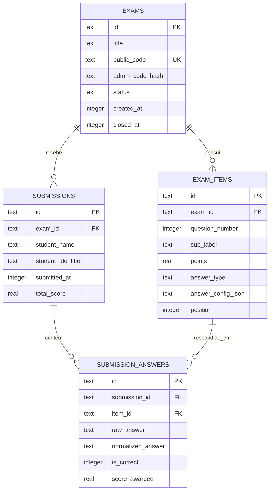

# 📝 GabaritoWEB

> Plataforma web _mobile-first_ para publicação e autocorreção de gabaritos de provas — sem cadastro, sem complicação.

[](https://nodejs.org)
[](https://react.dev)
[](https://www.typescriptlang.org)
[](https://hono.dev)
[](https://sqlite.org)
[](https://docker.com)
[](LICENSE)

---

## ✨ Visão Geral

O **GabaritoWEB** permite que professores criem provas com gabarito oficial e compartilhem um link ou QR Code com os alunos. Os alunos submetem suas respostas e recebem a correção automaticamente assim que a prova é encerrada — sem necessidade de cadastro para nenhuma das partes.

### Fluxo resumido

```
Professor cria a prova  →  Compartilha o código/QR Code
Aluno submete respostas →  Aguarda encerramento
Professor encerra prova →  Aluno consulta nota detalhada
```

---

## 🚀 Funcionalidades

| Funcionalidade                   | Descrição                                                                                 |
| -------------------------------- | ----------------------------------------------------------------------------------------- |
| 📋 **Criação de provas**         | Múltiplas questões com subitens, pontuações individuais e tipos variados                  |
| 🔢 **Tipos de questão**          | Múltipla escolha, Verdadeiro/Falso e Texto exato                                          |
| 📱 **QR Code automático**        | Gerado na criação da prova para compartilhamento rápido                                   |
| ✅ **Autocorreção**              | Correção instantânea no servidor com normalização de texto (acentos, maiúsculas, espaços) |
| 🔒 **Sem gabarito exposto**      | O gabarito nunca trafega para o cliente; a correção ocorre 100% no servidor               |
| 📊 **Dashboard em tempo real**   | Painel do professor atualizado automaticamente com novas submissões via polling           |
| 🚫 **Anti-duplicidade**          | Impede que um mesmo aluno (por matrícula) submeta mais de uma vez                         |
| 📤 **Import/Export de gabarito** | Exporta e importa configurações de prova em formato JSON                                  |
| 🌙 **Tema escuro**               | Interface moderna com glassmorphism, tema slate/ciano e suporte _mobile-first_            |
| 🐳 **Docker pronto**             | Ambientes de desenvolvimento e produção via Docker Compose                                |

---

## 🛠️ Stack Tecnológica

### Frontend

- **[React 19](https://react.dev)** + **[TypeScript](https://www.typescriptlang.org)** — SPA com roteador reativo próprio (sem biblioteca externa)
- **[Vite](https://vitejs.dev)** — Build tool e servidor de desenvolvimento
- **[Tailwind CSS v4](https://tailwindcss.com)** — Estilização _utility-first_ com tema escuro personalizado

### Backend

- **[Node.js](https://nodejs.org)** + **[Hono](https://hono.dev)** — API REST leve e performática
- **[SQLite](https://sqlite.org)** (modo WAL) — Banco de dados embarcado e portável
- **[Drizzle ORM](https://orm.drizzle.team)** + **Drizzle Kit** — ORM type-safe e migrações

### Infraestrutura

- **[Docker](https://docker.com)** + **Docker Compose** — Containers para dev e produção
- **[Caddy](https://caddyserver.com)** _(recomendado)_ — Servidor web para produção com HTTPS automático

---

## 📂 Estrutura do Projeto

```text
gabarito-web/
├── backend/                        # API Hono & Banco de dados
│   ├── src/
│   │   ├── db/
│   │   │   ├── index.ts            # Conexão SQLite (modo WAL)
│   │   │   └── schema.ts           # Schemas Drizzle ORM
│   │   ├── middleware/
│   │   │   └── rateLimiter.ts      # Rate limiting por IP (5 req/min)
│   │   ├── utils/
│   │   │   └── normalizer.ts       # Pipeline de normalização de respostas
│   │   └── index.ts                # Definição de rotas e servidor Hono
│   ├── Dockerfile                  # Imagem de produção
│   ├── Dockerfile.dev              # Imagem de desenvolvimento (hot-reload)
│   ├── drizzle.config.ts           # Configuração do Drizzle Kit
│   └── package.json
├── frontend/                       # SPA React
│   ├── src/
│   │   ├── pages/
│   │   │   ├── Home.tsx            # Página inicial (escolha de papel)
│   │   │   ├── TeacherCreate.tsx   # Criação de prova pelo professor
│   │   │   ├── TeacherDashboard.tsx# Painel de administração da prova
│   │   │   ├── StudentExam.tsx     # Tela de resposta do aluno
│   │   │   └── StudentResult.tsx   # Tela de consulta de nota
│   │   ├── components/             # Componentes reutilizáveis (Modal, etc.)
│   │   ├── App.tsx                 # Roteador reativo e layout principal
│   │   ├── main.tsx                # Ponto de entrada do React
│   │   └── index.css               # Importações do Tailwind v4 e estilos base
│   ├── Dockerfile.dev              # Imagem de desenvolvimento
│   ├── vite.config.ts              # Proxy /api → porta 3000
│   └── package.json
├── docker-compose.yml              # Ambiente de produção (padrão)
├── docker-compose.dev.yml          # Ambiente de desenvolvimento
├── manage.sh                       # Script central de gerenciamento
├── test-api.sh                     # Testes de integração da API
├── package.json                    # Workspace root (npm workspaces)
└── .agents/
    └── SDD.md                      # Documento de Especificação Técnica
```

---

## ⚡ Início Rápido

### Pré-requisitos

- [Node.js 22+](https://nodejs.org)
- [npm 10+](https://npmjs.com)
- [Docker](https://docker.com) e Docker Compose _(opcional, para execução em containers)_

### 1. Clonar e instalar dependências

```bash
git clone https://github.com/seu-usuario/gabarito-web.git
cd gabarito-web
npm install
```

### 2. Configurar o banco de dados

```bash
npx drizzle-kit push --config=backend/drizzle.config.ts
```

### 3. Executar em desenvolvimento (local)

```bash
npm run dev
```

Isso inicia:

- **Frontend (Vite):** http://localhost:5173
- **Backend (Hono):** http://localhost:3000

---

## 🐳 Execução com Docker

### Desenvolvimento (hot-reload)

```bash
./manage.sh dev-start   # Sobe os containers em segundo plano
./manage.sh dev-stop    # Para e remove os containers
```

- Frontend disponível em: **http://localhost:5173**
- Backend disponível em: **http://localhost:3000**

### Produção

```bash
./manage.sh prod-start  # Build, migração de banco e inicialização da API
./manage.sh prod-stop   # Para o container de produção
```

> **Nota:** Em produção, o Caddy (ou outro servidor web) deve servir a pasta `frontend/dist/` e fazer proxy reverso das requisições `/api/*` para a porta **3000**.

---

## 🧰 Script `manage.sh` — Referência Completa

| Comando                  | Descrição                                                      |
| ------------------------ | -------------------------------------------------------------- |
| `./manage.sh dev-start`  | Sobe os containers de desenvolvimento via Docker Compose       |
| `./manage.sh dev-stop`   | Para e remove os containers de desenvolvimento                 |
| `./manage.sh prod-start` | Build do frontend + migração do banco + inicia API de produção |
| `./manage.sh prod-stop`  | Para o container da API de produção                            |
| `./manage.sh build`      | Build completo do monorepo (backend + frontend) localmente     |
| `./manage.sh db-push`    | Sincroniza o schema TypeScript com o banco SQLite              |
| `./manage.sh format`     | Formata o código-fonte com Prettier                            |
| `./manage.sh test`       | Executa testes unitários e testes de integração da API         |

---

## 🗄️ Modelo de Dados



### Tipos de Questão (`answer_type`)

| Tipo         | Descrição                   | Exemplo de gabarito                 |
| ------------ | --------------------------- | ----------------------------------- |
| `choice`     | Múltipla escolha (letra)    | `{ "accepted": ["A"] }`             |
| `true_false` | Verdadeiro ou Falso         | `{ "accepted": ["V"] }`             |
| `text_exact` | Texto exato (com variações) | `{ "accepted": ["MASSA", "PESO"] }` |

---

## 🔌 API — Referência dos Endpoints

Todas as rotas utilizam `Content-Type: application/json`.

### Professor

| Método | Rota                                  | Descrição                                            |
| ------ | ------------------------------------- | ---------------------------------------------------- |
| `POST` | `/api/exams`                          | Cria uma nova prova                                  |
| `GET`  | `/api/admin/exams/:admin_token`       | Consulta painel da prova (com gabarito e submissões) |
| `POST` | `/api/admin/exams/:admin_token/close` | Encerra a prova e libera notas                       |

### Aluno

| Método | Rota                                  | Descrição                                        |
| ------ | ------------------------------------- | ------------------------------------------------ |
| `GET`  | `/api/exams/:public_code`             | Busca a prova pelo código público (sem gabarito) |
| `POST` | `/api/exams/:public_code/submissions` | Envia as respostas do aluno                      |
| `GET`  | `/api/submissions/:submission_id`     | Consulta nota e detalhamento da correção         |

### Exemplo: Criar Prova

```bash
curl -X POST http://localhost:3000/api/exams \
  -H "Content-Type: application/json" \
  -d '{
    "title": "Física Geral I — Prova 1",
    "items": [
      {
        "question_number": 1,
        "sub_label": "a",
        "points": 2.0,
        "answer_type": "choice",
        "answer_config": { "accepted": ["B"] }
      },
      {
        "question_number": 2,
        "sub_label": null,
        "points": 3.0,
        "answer_type": "true_false",
        "answer_config": { "accepted": ["V"] }
      }
    ]
  }'
```

**Resposta `201 Created`:**

```json
{
  "id": "abc123",
  "public_code": "G26-DNEM9G",
  "admin_token": "adm_A7K9QF",
  "message": "Prova criada com sucesso!"
}
```

---

## 🧪 Testes

### Testes unitários (backend)

```bash
npm run test:unit
```

### Testes de integração (API completa)

```bash
./manage.sh test
```

O script detecta automaticamente se a API está no ar e, caso não esteja, sobe uma instância temporária para executar os testes.

---

## 🔐 Segurança

| Mecanismo                | Detalhes                                                                           |
| ------------------------ | ---------------------------------------------------------------------------------- |
| **Token administrativo** | Formato `adm_XXXXXX` (6 chars base36). Apenas o hash SHA-256 é armazenado no banco |
| **Código público**       | Formato `GYY-XXXXXX` (ano + 6 chars base36). Não expõe o gabarito                  |
| **Gabarito oculto**      | A rota pública `/api/exams/:public_code` nunca retorna `answer_config_json`        |
| **Notas ocultas**        | Enquanto a prova estiver aberta, `total_score` retorna `null` para o aluno         |
| **Rate limiting**        | Máximo de 5 submissões por IP por minuto na rota de envio de respostas             |
| **Anti-duplicidade**     | Matrícula duplicada na mesma prova retorna `409 Conflict`                          |
| **Comprovante compacto** | ID de submissão com 6 chars base36 com detecção de colisão e retry                 |

---

## ⚙️ Normalização de Respostas

Para aceitar variações textuais sem exigir configuração complexa, o backend aplica um pipeline de limpeza antes de comparar respostas:

1. **Trim** — Remove espaços no início e no final
2. **NFD Unicode** — Decompõe acentos e caracteres especiais
3. **Remoção de diacríticos** — Remove marcas de acento
4. **Cedilha** — Mapeia `Ç` → `C`
5. **Maiúsculas** — Converte tudo para `UPPERCASE`
6. **Espaços** — Colapsa múltiplos espaços em um único

**Mapeamentos Verdadeiro/Falso:**

| Entrada do aluno                                      | Interpretado como |
| ----------------------------------------------------- | ----------------- |
| `V`, `VERDADEIRO`, `VERDADE`, `SIM`, `S`, `TRUE`, `T` | `V`               |
| `F`, `FALSO`, `NAO`, `N`, `FALSE`                     | `F`               |

**Exemplo `text_exact`:**

```
Gabarito:  ["o mesmo", "a mesma", "igual"]
Resposta:  "  À mesma. "
Após norm: "A MESMA"  ✅ Correto
```

---

## 🗂️ Drizzle ORM — Comandos Úteis

```bash
# Aplica o schema TypeScript diretamente no banco SQLite
npx drizzle-kit push --config=backend/drizzle.config.ts

# Abre o painel visual interativo do banco de dados
npx drizzle-kit studio --config=backend/drizzle.config.ts
```

> **Atenção:** Execute sempre a partir da raiz do monorepo.

---

## 🌐 Deploy em Produção

### Arquitetura recomendada

```
Internet → Caddy (HTTPS + arquivos estáticos) → /api/* → Hono API (Docker, porta 3000)
                                               → /*     → frontend/dist/
```

### Passos

```bash
# 1. Gerar build do frontend, migrar banco e subir API
./manage.sh prod-start

# 2. Configurar o Caddy (exemplo de Caddyfile):
# gabarito.exemplo.com {
#     root * /srv/gabarito
#     file_server
#     reverse_proxy /api/* localhost:3000
# }
```

O banco de dados SQLite é persistido automaticamente no volume Docker `gabaritoweb-db`.

---

## 🤝 Contribuindo

1. Faça um _fork_ do repositório
2. Crie uma _branch_: `git checkout -b feature/minha-feature`
3. Realize seus commits: `git commit -m 'feat: adiciona minha feature'`
4. Formate o código: `./manage.sh format`
5. Execute os testes: `./manage.sh test`
6. Abra um _Pull Request_

---

## 📄 Licença

Distribuído sob a licença **MIT**. Consulte o arquivo [LICENSE](LICENSE) para mais detalhes.

---

<div align="center">
  <sub>Desenvolvido com ❤️ para facilitar a vida de professores e alunos.</sub>
</div>
